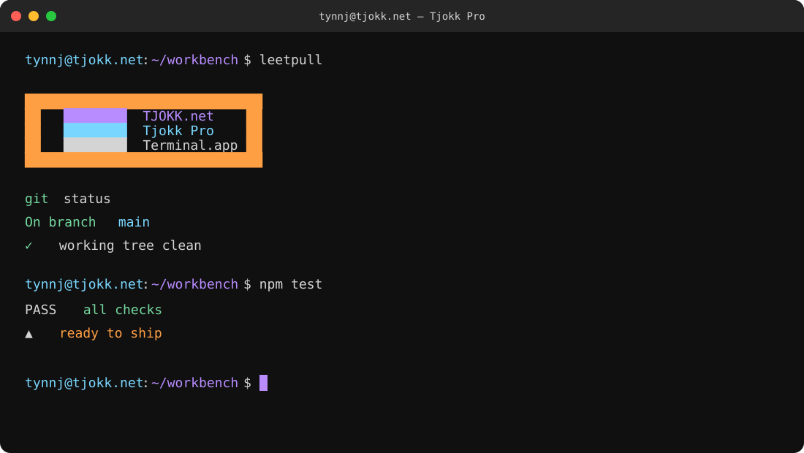

# Tjokk Pro

> A macOS **Terminal.app** profile inspired by **Monokai Pirokai – Arctic Frost** and VSCode user overrides.

## Install

1. Double-click [`Tjokk Pro.terminal`](Tjokk%20Pro.terminal).
2. Select **Import**.
3. Choose **Tjokk Pro** in Terminal → Settings → Profiles.

## Apply colors

Set transparency manually in **Profiles → Window → Background → Color & Effects**. Use **80% opacity**.

## Palette

| Color      | Hex                   |
| ---------- | --------------------- |
| Background | `#101010` / `#181818` |
| Text       | `#D4D4D4`             |
| Cursor     | `#B88CFF`             |
| Selection  | `#B88CFF` · 25%       |
| Cyan       | `#79D7FF`             |
| Purple     | `#B88CFF`             |
| Orange     | `#FF9F43`             |
| Green      | `#74D99F`             |
| Red        | `#FF6B8A`             |

## No warranty

